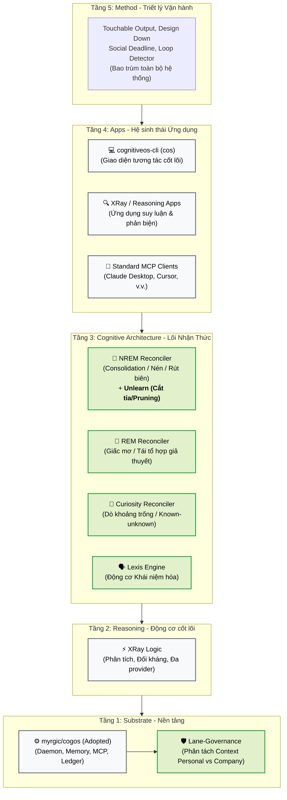
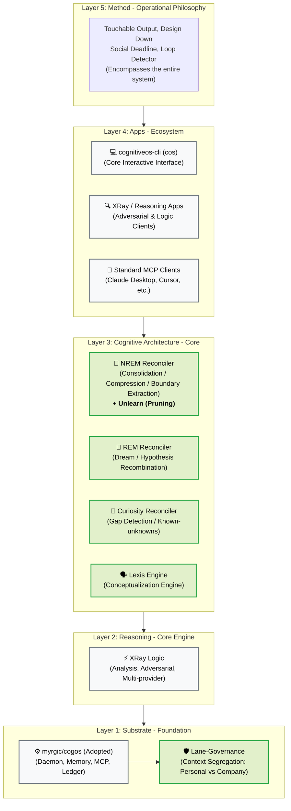
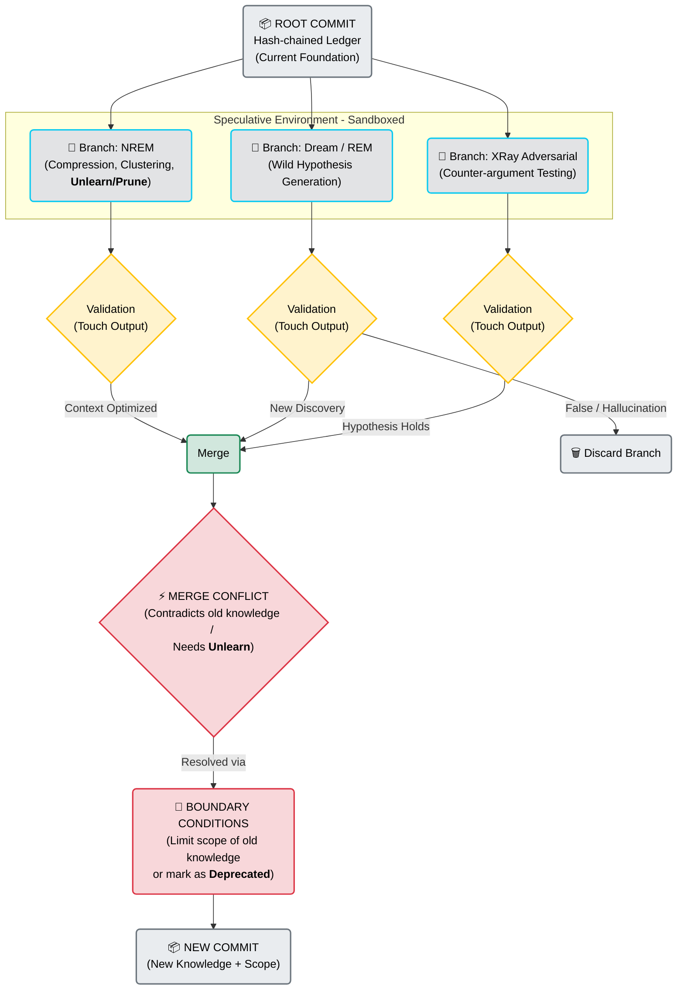

# CognitiveOS: Môi trường Vận hành Nhận thức cho AI / A Cognitive Operating System for AI

*(English version below)*

## 🇻🇳 Phiên bản Tiếng Việt

**CognitiveOS** không phải là một công cụ AI hay một thư viện Prompt Engineering. Đây là một Hệ điều hành (Operating System) thực thụ dành cho kỷ nguyên Agentic AI. 

Giao điểm giữa khoa học nhận thức (Cognitive Science) và độ tin cậy của AI (AI Reliability) chính là khả năng quản lý trạng thái, tạo ảo giác có kiểm soát, và học cách lãng quên (Unlearn). CognitiveOS giải quyết bài toán này bằng cách áp dụng mô hình **"Git cho Nhận thức" (Git for Cognition)**.

---

### 1. Bản đồ Kiến trúc 5 Tầng (The 5-Layer Map)

Sơ đồ này phân định rõ ranh giới các cấu phần. Điểm mấu chốt nằm ở **Tầng 3** (Lõi Kiến trúc Nhận thức) và cơ chế kiểm soát dữ liệu tại **Tầng 1** (Phân luồng Context).



---

### 2. Mô hình Vận hành: "Git cho Nhận thức" (Git for Cognition)

Sơ đồ này mô tả cách các pha nhận thức (Ngủ/Mơ/Tò mò) và module suy luận (XRay) vận hành như một hệ thống kiểm soát phiên bản nhánh (branching) nhằm đảm bảo **an toàn đầu cơ** (không làm hỏng tri thức gốc). Đặc biệt, đây cũng là nơi giải quyết bài toán **"Unlearn" (Học quên)**.

```mermaid
graph TD
    C1("📦 COMMIT GỐC<br>Hash-chained Ledger<br>(Tri thức nền hiện tại)") --> B1
    C1 --> B2
    C1 --> B3

    subgraph Branching [Môi trường Đầu Cơ - Cô lập (Sandboxed)]
        B1("🌿 Branch: NREM<br>(Nén, gom nhóm, <b>Unlearn/Prune</b>)")
        B2("🌿 Branch: Giấc mơ / REM<br>(Sinh giả thuyết điên rồ)")
        B3("🌿 Branch: XRay Phản biện<br>(Thử nghiệm phản đề)")
    end

    B1 --> Val1{"Đánh giá <br>(Touch Output)"}
    B2 --> Val2{"Đánh giá <br>(Touch Output)"}
    B3 --> Val3{"Đánh giá <br>(Touch Output)"}

    Val1 -- "Tối ưu context" --> MR("Tích hợp (Merge)")
    Val2 -- "Sai / Ảo giác" --> Drop("🗑️ Discard (Xóa nhánh)")
    Val2 -- "Phát hiện mới" --> MR
    Val3 -- "Giả thuyết đứng vững" --> MR

    MR --> Conf{"⚡ MERGE CONFLICT<br>(Mâu thuẫn tri thức cũ / <br>Cần <b>Unlearn</b>)"}
    
    Conf -- Giải quyết bằng --> BC("🎯 ĐIỀU KIỆN BIÊN<br>(Giới hạn phạm vi tri thức cũ<br>hoặc đánh dấu là <b>Deprecated</b>)")
    BC --> C2("📦 COMMIT MỚI<br>(Tri thức mới + Phạm vi áp dụng)")

    classDef core fill:#e9ecef,stroke:#6c757d,stroke-width:2px,color:#000;
    classDef branch fill:#e2e3e5,stroke:#0dcaf0,stroke-width:2px,color:#000;
    classDef validation fill:#fff3cd,stroke:#ffc107,stroke-width:2px,color:#000;
    classDef merge fill:#d1e7dd,stroke:#198754,stroke-width:2px,color:#000;
    classDef conflict fill:#f8d7da,stroke:#dc3545,stroke-width:2px,color:#000;

    class C1,C2 core;
    class B1,B2,B3 branch;
    class Val1,Val2,Val3 validation;
    class Drop core;
    class MR merge;
    class Conf,BC conflict;
```

#### Cách đọc Sơ đồ Vận hành:
1.  **Commit (Bất biến):** Mọi sự thật hiện tại được neo lại. Kiến trúc Sổ cái (Ledger) là append-only (chỉ thêm vào), do đó hệ thống không bao giờ "xóa" (delete) lịch sử.
2.  **Branch (An toàn):** Khi hệ thống rảnh rỗi (Ngủ/REM) hoặc bị thách thức (XRay), nó tạo một nhánh tư duy mới. Ở đây, AI có thể thử nghiệm hoặc sinh ý tưởng mới mà không phá hỏng cấu trúc dữ liệu chính.
3.  **Merge Conflict, Điều kiện biên & Bài toán "Unlearn":** Khi một tri thức cũ bị chứng minh là sai lệch hoặc lỗi thời, quá trình "Unlearn" không xóa bỏ dữ liệu cũ đi. Thay vào đó, ở bước xử lý Merge Conflict, hệ thống tạo ra một **Điều kiện biên** (Boundary Condition) để giới hạn tri thức cũ lại. Kết quả là một **Commit mới** được tạo ra. Đây là cách tiếp cận *Belief Revision* (Cập nhật niềm tin) chuẩn mực cho hệ thống append-only.

---

### 3. Lexis Engine: Động cơ Khái niệm hóa (The Naming Engine)

Lexis Engine đóng vai trò lõi trong Tầng 3, giúp hệ thống tiến hóa khả năng tư duy khái niệm.

*   **Lexis là gì?** Xuất phát từ tiếng Hy Lạp "λέξις" có nghĩa là *từ vựng / lời nói*. 
*   **Cơ chế hoạt động:** Khi hệ thống thực hiện quá trình nén (NREM) và tái tổ hợp (REM), nếu nó phát hiện ra một **cụm mẫu lặp lại ổn định** (một cấu trúc ngầm - tacit structure) nhưng chưa có tên gọi, Lexis Engine sẽ tự động đúc (coin) ra một từ vựng mới kèm theo định nghĩa và điều kiện biên cho nó.
*   **Tiến hóa ngôn ngữ:** Từ vựng mới này được đưa vào từ điển của hệ thống với tư cách là một thành tố hạng nhất. Nhờ đó, CognitiveOS có thể tham chiếu và dùng nó để xây dựng các khái niệm phức tạp hơn. 

#### Giá trị của việc Khái niệm hóa:
Một hệ thống không thể thao tác rành mạch về một thứ chưa có tên. Việc đặt tên cho một mẫu hình giúp nén thông tin để lưu trữ và xử lý hiệu quả. Khả năng tự động hóa việc hình thành khái niệm (Conceptualization) cho phép CognitiveOS mở rộng năng lực giải quyết vấn đề mà không bị giới hạn bởi từ vựng ban đầu.

---

### 4. Triết lý "Unlearn" (Học Quên) trong CognitiveOS

Giao điểm giữa khoa học nhận thức (cognitive science) và độ tin cậy của AI (AI reliability) chính là bài toán **Unlearn**. Trong CognitiveOS, Unlearn không phải là một thao tác xóa, mà là một quy trình có cấu trúc:

1.  **Hệ thống phân tán không xóa:** Lịch sử trong sổ cái (Hash-chained ledger) là bất biến. Unlearning thực chất là ức chế đầu ra (inhibition) hoặc giới hạn bối cảnh (context bounding), không phải là bôi đen dữ liệu. 
2.  **Học kèm điều kiện biên (Boundary Conditions):** Khi ghi nhận một tri thức, Lexis Engine gắn kèm metadata giới hạn. Tri thức tự động hết hạn hoặc bị chặn lại khi hệ thống di chuyển sang một context khác (ví dụ: chuyển từ Lane Cá nhân sang Công ty). 
3.  **Unlearn là một pha (Phase), không phải một thao tác (Operation):** Unlearn diễn ra chủ yếu trong pha **NREM** - một tiến trình chạy ngầm (offline) để cắt tỉa (prune) và nén tri thức.
4.  **Truth Maintenance (Bảo trì sự thật):** Rủi ro lớn nhất là sự lan truyền thu hồi. Khi hệ thống vô hiệu hóa tri thức X, quá trình Merge Conflict sẽ rà soát và đánh giá lại tri thức Y (nếu Y được xây dựng dựa trên X).

---
---

## 🇬🇧 English Version

**CognitiveOS** is a true Operating System for the Agentic AI era.

The intersection of Cognitive Science and AI Reliability is the ability to manage state, orchestrate controlled speculations, and learn how to forget (Unlearn). CognitiveOS solves this by applying a **"Git for Cognition"** model.

---

### 1. The 5-Layer Map

This diagram defines the boundaries of the components. Our core focus is **Layer 3** (Cognitive Architecture), alongside refinement at **Layer 1** (Context Segregation).



---

### 2. Operational Model: "Git for Cognition"

This model describes how cognitive phases (Sleep/Dream/Curiosity) and reasoning modules (XRay) operate as a branching version-control system to ensure **speculative safety**. Crucially, this is where the **"Unlearn"** process happens.



#### How to Read the Operational Model:
1.  **Commit (Immutable):** All current truths are anchored. The Ledger architecture is append-only, meaning the system never deletes history.
2.  **Branch (Sandboxed):** When idle (Sleep/REM) or challenged (XRay), the system creates a new cognitive branch. Here, the AI can safely speculate or generate new ideas without breaking the production database.
3.  **Merge Conflict, Boundary Conditions & The "Unlearn" Problem:** When old knowledge is proven wrong or obsolete, "Unlearning" is not about deleting the old data. Instead, during the Merge Conflict resolution, the system creates a **Boundary Condition** to quarantine the old knowledge. The result is a **New Commit** containing the cleansed knowledge. This implements *Belief Revision* for an append-only system.

---

### 3. Lexis Engine: The Conceptualization Engine

Lexis Engine plays a core role at Layer 3, helping the system evolve its conceptual thinking capabilities.

*   **Mechanism:** When the system performs compression (NREM) and recombination (REM), if it detects a **stable recurring pattern** (a tacit structure) that lacks a name, the Lexis Engine automatically coins a new vocabulary term, complete with a definition and boundary conditions.
*   **Language Evolution:** This new term is added to the system's lexicon as a *first-class citizen*. CognitiveOS can then reference and build upon it to form more complex concepts. 

#### The Value of Conceptualization:
A system cannot manipulate or reason clearly about something that lacks a name. Naming a pattern compresses it, making it easier to store and process. Automating conceptualization allows CognitiveOS to expand its problem-solving capacity without being limited by its initial vocabulary.

---

### 4. The "Unlearn" Philosophy in CognitiveOS

In CognitiveOS, Unlearning is a deeply structured process rather than a deletion operation:

1.  **Immutable History:** History in a Hash-chained ledger is append-only. Unlearning in AI is essentially *output inhibition* or context bounding, not wiping data.
2.  **Learning with Boundary Conditions:** When recording knowledge, the Lexis Engine attaches metadata to bound it. Knowledge automatically expires or is blocked when the system moves to a different context (e.g., from Personal to Company lane).
3.  **Unlearn is a Phase, not an Operation:** Unlearning occurs primarily in the **NREM** phase as an offline background job designed to prune and compress knowledge.
4.  **Truth Maintenance:** When the system invalidates knowledge X, the Merge Conflict process will review and re-evaluate knowledge Y (if Y was built upon X).
